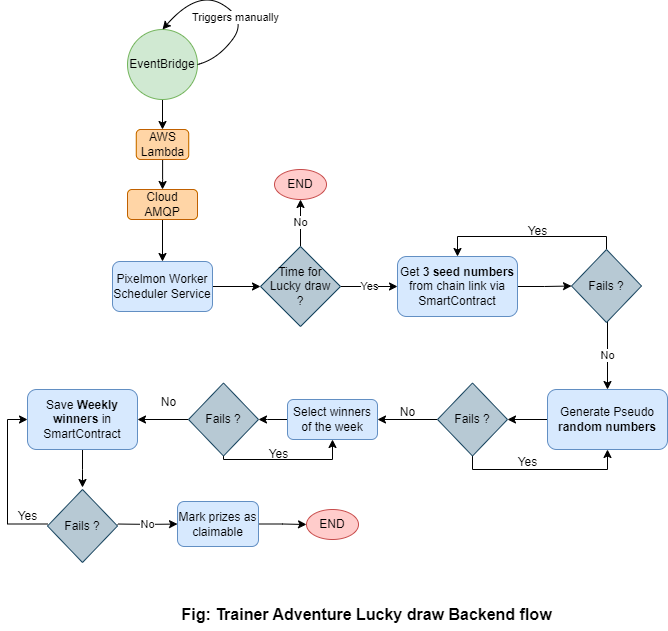
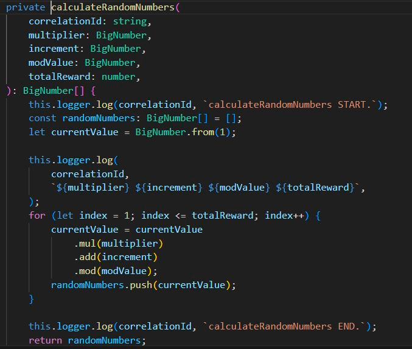
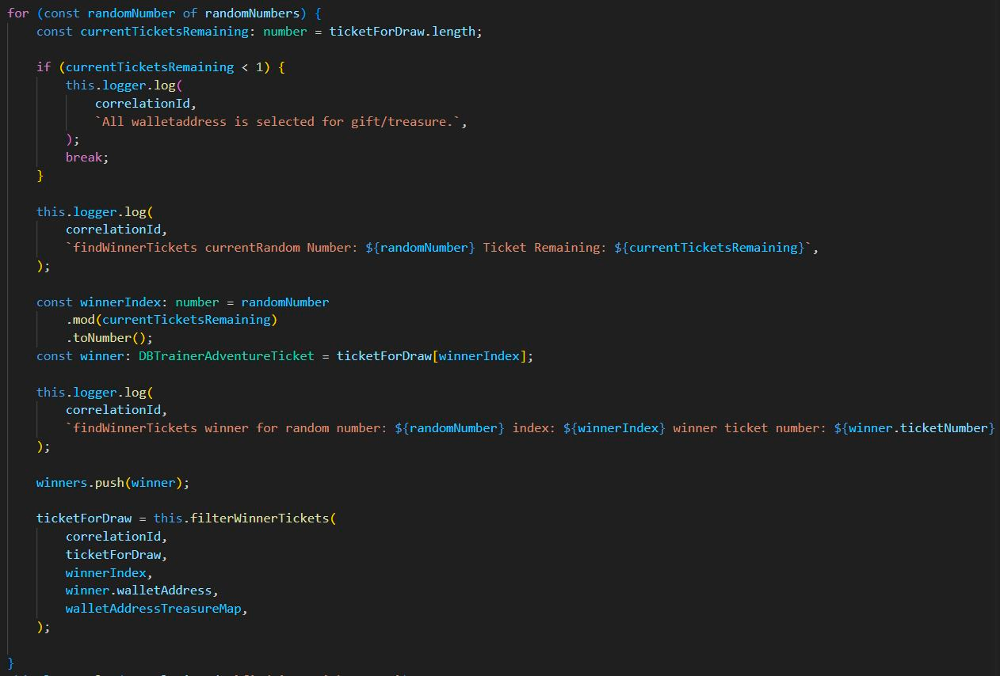

---

# Lucky Draw Process in the Pixelmon Trainer Adventure

## Overview
Our Pixelmon trainer adventure allows the holders of our Trainers and Pixelmon tokens to soft stake those tokens and win prizes (sponsor trips, evolution serum, trainer gear, etc.) by participating in weekly lucky draws.

The lucky draw process in the Pixelmon trainer adventure involves generating a collection of tickets and selecting winners based on a pseudo-randomized number generated using a [Linear Congruential Generator](https://en.wikipedia.org/wiki/Linear_congruential_generator) based on seeds numbers that are randomly generated by [Chainlink](https://docs.chain.link/vrf/v2/subscription/examples/get-a-random-number).

## Lucky draw process flow

## 1. Ticket generation
- Trainer(s) are soft-staked by their holders with or without the Pixelmon token.

- During the week of the draw, a  scheduler process identifies Trainers and Pixelmons that were soft-staked for a minimum of `7` days and assigns `1` ticket for the **Trainer** and `1` ticket for **Pixelmon** token.

 > Notice that each generated ticket is assigned a monotonically increasing sequence number as the `ticket number`.  Furthermore, each ticket is mapped to the wallet address of its Trainer or Pixelmon.

## 2. Draw initiation
3. Every week on **Tuesday** at `12PM SGT`, the lucky draw process is initiated by our backend service.

  - In the lucky draw, the backend process considers tickets that are distributed before ``8:30 AM SGT``.  Furthermore, if a Trainer or a Pixelmon gets unstaked, transferred, or sold by the user before ``9:00AM SGT + draw initialization time(5-15 mins)``, the associated tickets with those unstaked tokens are **not** considered for the draw.

  - No wallet address can win more than two rewards in a single week.

  - A wallet address can win at most `1` sponsor trip.

  - Each week, the winning tickets are chosen from a pool of eligible tickets available for that particular week's draw.

  - The wallet addresses associated with that tickets become the winner of the rewards.

## 3. Random number generation using random seeds
- Every Tuesday between `9am-12pm SGT`, our backend service calls our [smart contract's](https://etherscan.io/address/0x13182b9b97d27c5b09c5809b93c31f745d54ac82#code) `generateChainLinkRandomNumbers` method

- Our smart contract receives `3` randomly generated seed numbers from  [Chainlink](https://vrf.chain.link/mainnet).

- Based on those `3` randomly generated seed numbers (`uint256`), the backend generates `163` pseudo-randomized numbers using the [Linear congruential generator](https://en.wikipedia.org/wiki/Linear_congruential_generator), [* more ref](https://www.freecodecamp.org/news/random-number-generator#the-linear-congruential-generator)

## 4. Winner selection
- The backend process then sorts all tickets based on the `ticket number` and creates an **array of tickets** that are used for selecting winners for that week.

- For each round of winner selection:
  - Using the `3` random seeds in the Linear congruential generator formula, the backend process chooses the winning index within the array of tickets.
  - For each round, the winning ticket is eliminated from the array so that it is not considered in the future rounds of draw.
  - If a wallet address has won 2 rewards, the backend process eliminates all of its associated tickets from the future draws (to ensure a wallet address does *not* win more than 2 rewards).

## 5. Winner selection stored in the smart contract
Once all winners have been chosen for the week, the backend process stores the winning wallet addresses and their respective count of prizes in the Trainer adventure smart contract by calling the `updateWeeklyWinners` method.

## 6. Claiming treasure
- According to the claiming start and end timestamps, the winner of a week's draw calls the `claimTreasure` method in our Trainer adventure smart contract using our Pixelmon [staking site](https://staking.pixelmon.ai/) to claim their treasure.

 - If it's the first treasure being claimed, the user has not won any sponsor trip before, and there are sponsor trips rewards are available, the Smart Contract will check whether the user is the winner of a Sponsored Trip. Otherwise, it will choose a random treasure.
 - If it's not the first treasure (i.e. second treasure, third treasure, etc.), it will try to select a treasure different than the first one randomly (`getRandomNumber` method in the smart contract) provided that there are other types of rewards available in its vault.

## 7. Treasure distribution to the claiming winners
The Smart Contract then finally transfers the treasure from the vault wallet address to the winner wallet address.

# Links to deployed smart contracts in the Mainnet
- [Trainer Adventure Smart Contract__(NEW)__](https://etherscan.io/address/0x13182b9b97d27c5b09C5809b93c31F745d54aC82)
- [Trainer Gear Smart Contract](https://etherscan.io/address/0x05A6528663278f51f9cc22D0bb3ca0E1e0a3Ae2f)
- [Sponsored Trips Smart Contract ](https://goerli.etherscan.io/address/0x90c3D47914DF3C4df4D281DCaA5AB2BB4996c162)

# Lucky draw winner verification using ticket list
It is possible to download the tickets distribution for each week's draw and then run a script to **re-create** the list of winners for the previous week.

## Download verification script and instructions
- [README](./scripts/trainer-adventure-verification/README.md)
- [Package.json](./scripts/trainer-adventure-verification/package.json)
- [trainer-adventure-verification.js](./scripts/trainer-adventure-verification/trainer-adventure-verification.js)

## Data used in the weekly draw process
- [Sample download link for week 9: https://pixelmon-trainer-adventure.s3.ap-southeast-1.amazonaws.com/participated-tickets/tickets-week-9.csv](https://pixelmon-trainer-adventure.s3.ap-southeast-1.amazonaws.com/participated-tickets/tickets-week-9.csv)
- Note: Week number started from `2` and file name format is `tickets-week-{Week Number}.csv`
