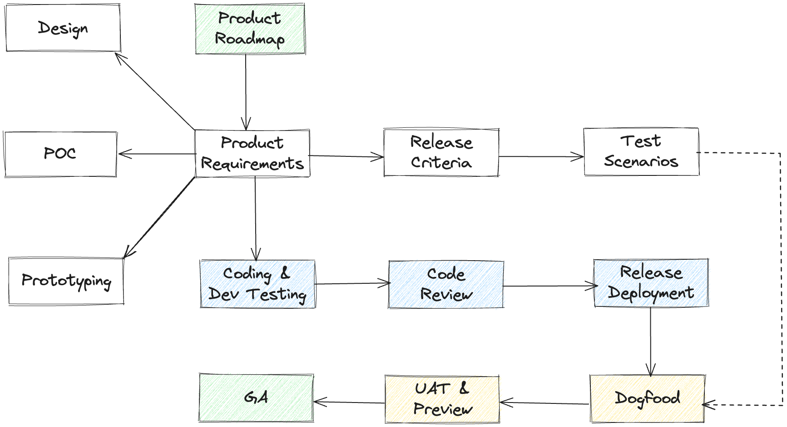

---

# Engineering Excellence Strategy
Contemporary [research](https://www.thoughtworks.com/radar/techniques/four-key-metrics) shows that high-performing software development teams are essential for creating high-performing organizations.

- Change lead time - This is the amount of time it takes a committed change to get deployed into production
- Deployment frequency - how often we can successfully release to production
- Mean time to restore (MTTR) - how long it takes to recover from a failure in production
- Change fail percentage - percentage of deployments causing a failure in production

This document describes what we plan to do to improve our performance as a tech organization.

# 1. Change lead time
## Software development lifecycle
1. Product team provides a well-defined set of features and user stories
    - Product or feature description should contain associated UI design
    - The critical features and the release criteria for those feature should be well-defined
    - Product team will hold design meetings with engineers to clarify the product requirements
2. Dev team designs the solution and provides time/cost estimates
3. QA team prepares test cases and the product team defines the release criteria
4. Dev team completes development, dev testing (cf. Appendix I), and code review
5. QA team completes testing and signs off if the feature meets the release criteria
6. Product is released to internal and external customers for UAT and Preview (released using feature flighting)
7. Product goes GA (GA - general availability or live)

## Reduced inter-team dependency
Platform, blockchain, and infra teams agree to common interfaces, data formats and contracts during the product design phase. Each team is responsible for developing and testing against that contract and for delivering their components at the specified milestones.  Final integration test is performed once all components are available

## High quality bar
Developers will write unit tests (with >=95% coverage) and will do code reviews.  They will also be responsible for dev testing to ensure that the features have implemented the functionalities and are free of bugs.  QA team will focus on end-to-end testing and testing security, scalability, performance and ensures the software meets the release criteria.

# 2. Deployment frequency
- SSOT: To streamline our coding lifecycle, developers will move to a trunk-based deployment model and have a single-source of truth for all of our code.
- Ring-based deployment: We will deploy our product to our internal (product, CS) and preview customers early to test the product end-to-end.  We will utilize feature flighting to achieve a regular continuous deployment cadence.
- Faster deployment process -  Engineering teams will delegate the infrastructure maintenance work to the devops team.  The devops team will optimize our CI/CD pipeline to shorten our deployment cycle.

# 3. Change fail percentage
- Well-defined release criteria - A product or feature’s readiness for making it GA will be determined by the release criteria defined by the product team.
- Empowered QA team - QA team will spend adequate time to vote yes/no to denote whether the product/feature meets the release criteria.
- Accurate incident reporting - Leads will be responsible for reporting the details of every incident in the production that impacts our customers using incident reporting flow.
- RCA followup - Leads will be responsible for resolving every RCA bug opened to address the production incidents.
- Triage and review - Regular bug triage and service reviews will be held to achieve ZBB (zero bug bounce) before the product is made available to the customers.

# 4. Mean time-to-restore (MTTR)
- All apps, APIs, and critical services are covered with 24x7 monitoring and paging alerts.
- All Sev 0 and Sev 1 incidents trigger paging alerts using an alerting service.  Sev 2 incidents will trigger email alerts and will be resolved during regular business hours.
- Dev leads and org heads will respond to paging alerts and will use the predefined incident response SOP to maintain the response SLA:

| Severity | Description        | Examples                                                  | Response Time |
|----------|--------------------|-----------------------------------------------------------|---------------|
| 0        | Critical incident  | Service outage, data loss, ddos attack                    | 30 minutes    |
| 1        | Major incident     | One or more major features unavailable - no workarounds   | 1 Hours       |
| 2        | Minor incident     | One or more major features unavailable - with workarounds | 24 Hours      |
| 3        | User-reported bugs | Issues impacting one or more users                        | 48 Hours      |
