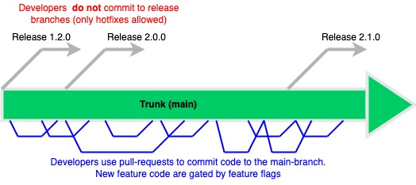
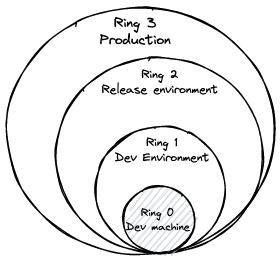

---
> Author: [Nobel Khandaker](https://www.linkedin.com/in/nobelkhandaker)

# How we code
Designing and developing a software (SAAS or client software) is a complex process that are often impacted by a variety of constraints.  Short time to market, shortage of engineering resources, complexity of the product requirements are often the common factors impacting any software development project. We use the described process to address the common challenges and deliver products that meets the quality bar required by our stakeholders.

# How should you use this engineering handbook?
The process described here is largely driven by our [Engineering excellence strategy](./engineering_excellence_strategy.html).
All engineers at LiquidX studio are *mandated* to follow the instructions included in this handbook.  __Any__ deviation from this engineering process requires *prior* approval from the head of engineering.

# 0. Before you code
Before the coding starts for a new product or feature, do the following:
1. Read the product requirements file and review the UI changes (if any)
2. Read and review the developer design document [design doc template](https://docs.google.com/document/d/1SV8qV3bE6zBeEbqtZ22irpXrOC6RLqWXy58AASRK9VY/edit?usp=sharing)
3. Create tracking work item on the task board

# 1. Single source of truth (SSOT)
We follow the Trunk-Based development model for version control and have a single source of truth for all software components and modules.  

## Key concepts
- Developers collaborate on the Trunk or the main branch
    - Use feature toggle by [Unleash](https://www.getunleash.io/) to *restrict* your changes so that you never break the build or cause regressions. [Read about feature flags](https://martinfowler.com/articles/feature-toggles.html)
- Release branches are created from the main branch
- Release branches are tagged with *major.minor.patch* version number `(000.000.000)`
    - Major version is incremented for *new* features or breaking changes
    - Minor version number is incremented for *feature updates* or *bug fixes*
    - Patch version numbers are incremented *only* for hotfix/patch
- After QA testing, the release branch is deployed into the production
    - Release branches are long-lived.  They can be used later to revert a change in the production branch, or to test a patch before deploying it to production

# 2. Source code
All changes that are deployed in the production (e.g., aws lambda scripts, SQL queries to create table/schema) are stored in our code repositories on Github:
- [LiquidX studio](https://github.com/LiquidX-Studio)
- [Pixelmon](https://github.com/Pixelation-Labs)

## Code changes
All code changes are done by creating a pull-request and then merging it to main branch after the code has been reviewed.

## Branch rules/protection
The pull requests to change the code on the main branch is protected by Github's branch protection rules:
- All conversations and comments by reviewers should be resolved
- Every pull request review requires signoffs from at least 2 reviewers before it can be merged
- All unit tests for that branch should be passing (i.e., $0$ regressions)
    - This is enforced by linking the branch our CI/CD pipeline defined within CircleCI using Github actions

# 3. Making a change
You are __required__ to do the following to create a pull request on a branch in the repository.

## Step 3.1 Follow Clean Coding
Follow [SOLID](https://www.geeksforgeeks.org/solid-principle-in-programming-understand-with-real-life-examples/) principle, use [clean coding](https://gist.github.com/wojteklu/73c6914cc446146b8b533c0988cf8d29)

## Step 3.2 Consistent Coding Style
You are required to follow a standard coding style:
- [Solidity](https://github.com/OpenZeppelin/code-style)
- [Typescript](https://google.github.io/styleguide/tsguide.html)
- [Python](https://peps.python.org/pep-0008/)

## Step 3.3: Formatting and Static analysis
- Format using IDE/editor and a code formatter e.g., [prettier](https://prettier.io/)
- Static analysis
    - Typescript/ Javascript - [eslint](https://eslint.org/docs/latest/user-guide/command-line-interface)
    - Python [Pyflakes](https://pypi.org/project/pyflakes/)
    - Solidity [slither](https://github.com/crytic/slither)

## Step 3.4: Write unit tests
If you are writing backend code (e.g., APIs, web services), your code should have unit test coverage of `>90%`.  For smart contracts, the unit test coverage should be 100%.

Your change should not break the existing unit tests.  Changes with the broken unit tests will be blocked from getting deployed in the production.

## Step 3.5: Test your feature
Test your feature on your local machine.

## Step 3.6: Create Pull requests
When you have completed static analysis, unit testing, and dev testing (in dev machine or in dev environment), create a pull request on the main branch.

> Never check in code that will break existing features without a failsafe - use feature flighting!

## Step 3.7: Code review
All code checkins require *at least 2* sign-offs from the reviewers before they can be merged to the `main` branch.

## Step 3.8: Test your feature
You are the sole owner of the feature/fix you are making for the product. So, you should test the changes thoroughly in the __dev__ and __release__ environment.

## Step 3.9: Bug fixes
If any bugs are found, do the following:
- Write a unit test(s) to cover the scenario
- Ensure that the unit test *fails* when you run on the existing code base
- Change the code to __fix__ the bug
- Ensure that the unit test case(s) is __now passing__
- Create a pull request (Step 3.1)

# 5. Deployment
## Deployment rings
All code changes will progress along the deployment path to be deployed into production:
- Ring 0 - developer's computer
- Ring 1 - Dev environment
- Ring 2 - Release environment (replica of the production)
- Ring (Staging) - Staging environment used only for testing Hotfixes
- Ring 3 - Production environment

## Deployment and testing in the Release environment
The devops team will *continually* create release branches from the main and deploy it to the Release environment.

# 6. Continuous Integration (CI) and Continuous Delivery (CD)
Our repositories are integrated with the build and deployment pipelines of the [CircleCI](https://circleci.com/) app.

## CI
When a pull request is merged to the main, it triggers the build in our CI/CD tool.  The build will fail if even a single unit test fails.

## CD
When your pull request is merged to the main, it is *auto-deployed* in the dev environment.  DevOps team will *continually* create release branches from the main branch

# 7. Production Deployment
## WAR room approval
- All changes destined for the production environment requires the approval of the [WAR room form](https://forms.gle/DF6RWTd4AAAEigdW9).
- Email/phone approval is sufficient in case of a critical production incident.

## Feature Management and Canary releases
The risk of deploying new feature or code is minimized by using a [canary release](https://martinfowler.com/bliki/CanaryRelease.html) approach
- Each change is gated by a feature flag and is initially released to a small subset of users using [Unleash](https://getunleash.io)
- In case of a regression or major issue, the feature is toggled off and the user experience remains intact
- The feature is made available to everyone once it has been tested in production

# Hotfixes and patching
Only in case of a __critical__ or a __major production incident__ ([see our SLA definition](./engineering_excellence_strategy.html)) we will patch our production deployment.

- Hotfix/patching requires __prior approval__ of the head of engineering
- Our devops team will create a staging branch which will have the *same* version as the production
- DevOps team will set the _branch policy__ so that all changes require 1) Pull request and 2) Code Reviews, and 3) Unit testing
- Developers will make changes to the staging branch using a pull request
- The staging branch is deployed in the staging environment for our feature owners (engineers) to test
- Once the QA verification is completed by the feature owners, we arrange dogfood testing sessions where everyone in the team including product managers and business owners to run thorough end-to-end tests
- After passing the dogfood tests, the change is deployed to the production
- QA team will verify the change in production to ensure there are no regressions
- Finally, the hotfix change is integrated in the main branch following the regular code review/testing process

# End notes
This guid is designed to provide guidance to our engineers, it *cannot* guarantee perfection of the overall engineering process or the final product.  We will continually have training/discussion sessions to review and collect feedback from our team members to further improve our effectiveness and efficiency.

# References
- [Trunk-based development](https://trunkbaseddevelopment.com/continuous-integration/)
- [Software development with feature toggles: practices used by practitioners](https://arxiv.org/pdf/1907.06157.pdf)
