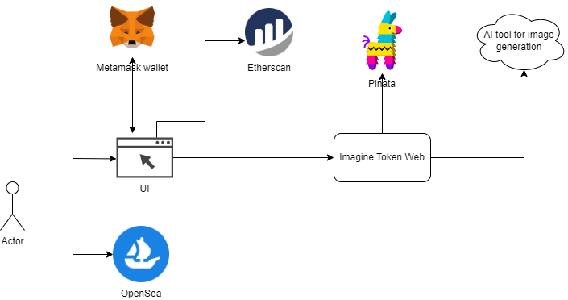

---

# Incubator Project - GenerativeAI-based Token Minting

> Author: [Amjad Hossain](https://www.linkedin.com/in/md-amjad-hossain-rahat/)

# Imagine Token
Imagine Token is an AI generative-based token minting system that allows users to mint Non-Fungible Tokens (NFTs) backed by AI-generated images. The system is designed to allow users to create unique NFTs based on a description of their desired image.

# System Components

The Imagine Token system is built on top of Ethereum blockchain technology and consists of several components that work together to provide a seamless and secure user experience. These components include:

## User Interface
The user interface (UI) provides a simple and intuitive interface for users to interact with the system. Users can log in using their Metamask wallet and enter a description of the image they would like to create. The UI also displays the four different images generated by the AI-based image generative tool and allows the user to select one image.

## AI Image Generation Tool
The Imagine Token system uses a third-party AI-based image generative tool DALL-E API to generate four different images based on the description provided by the user.

## Pinata
[Pinata](https://www.pinata.cloud/) provides access to [ipfs](https://docs.ipfs.tech/concepts/what-is-ipfs/) - a decentralized file storage platform that is used to store the generated images and metadata files for the NFTs.

## ERC-721 Smart Contract
The Imagine Token system uses a customized [ERC-721](https://eips.ethereum.org/EIPS/eip-721) standard smart contract to mint the NFTs.

## Etherscan
Etherscan is used to track the status of the transaction and to view the details of the minted token.

### OpenSea
[OpenSea](https://opensea.io/) is the platform where the token is viewable publicly and can be traded as well with many more features.

## Component Diagram

# Workflow to mint NFT
1. User logs in using their Metamask wallet.
2. User enters a description of the image they would like to create.
3. The AI-based image generative tool generates four different images based on the description provided by the user.
4. The user selects one image from the four generated images.
5. The selected image is uploaded to Pinata and a URI for the image is generated.
6. A JSON file containing the metadata for the NFT is created and uploaded to Pinata. A URI for the metadata file is generated.
7. The user is asked to pay a gas fee using their Metamask wallet.
8. Upon successful payment of the gas fee, the ERC-721 smart contract is communicated with to mint the NFT.
9. A transaction is initiated on the blockchain (Ethernet/Goerli).
10. Upon successful completion of the transaction, the minted token can be found in OpenSea.

## Smart contract and Blockchain
1. testnet smart contract  Address: 0xCA5289992D17e97c5782a6D770Cb9e3F3411355D
2. mainnet smart contract  Address: `TBD`
3. [testnet opensea token collection](https://testnets.opensea.io/collection/imagine-token)
4. mainnet opensea token collection: `TBD`

# Implementation
The preview version of this webapp is deployed on an EC2 machine in AWS.  It uses the Goerli testnet and uses the free access to Pinata and DALL-E. Users need an access key to mint using the currently deployed preview version. 

## Links to all code repositories on Github
1. [imagine-token-web](https://github.com/LiquidX-Studio/imagine-token-web)
2. [imagine-token-contract](https://github.com/LiquidX-Studio/imagine-token-contract)

## Links to smart contracts on Goerli
1. [Testnet (Goerli)](https://goerli.etherscan.io/address/0xCA5289992D17e97c5782a6D770Cb9e3F3411355D#code)

## Owner wallet for testnet deployment:
`0xC90Aec9a4273c00EEB1f41D4CC7f5e049207499d`

# Conclusion
The Imagine Token system provides a simple and intuitive way for users to create unique NFTs backed by AI-generated images. The system is built on top of Ethereum blockchain technology and consists of several components that work together to provide a seamless and secure user experience.

