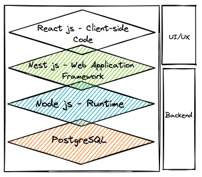
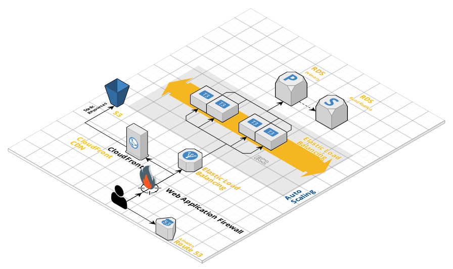
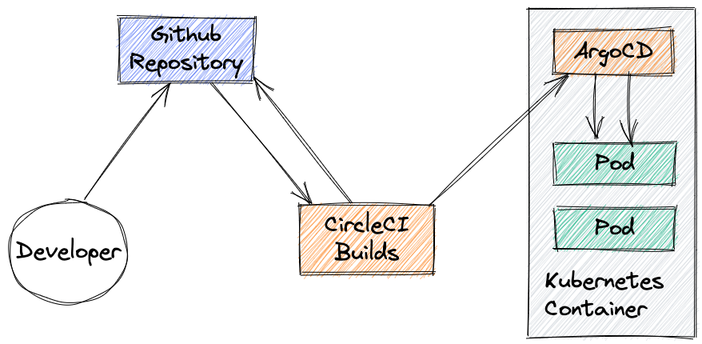

---

# Building from scratch

In the last few quarters, the liquidX studio's engineering team has built and shipped several smart contracts and web3 apps for our community.  This journey has been challenging since the product, our team, and the technology are all new and evolving.

## List of shipped projects
- [Pixelmon](https://www.pixelmon.ai/)
    - [PixelmonSponsoredTrips](https://goerli.etherscan.io/address/0x90c3D47914DF3C4df4D281DCaA5AB2BB4996c162#code)
- [Anime Metaverse](https://animemetaverse.ai)
    - [GachaDraw](https://etherscan.io/address/0xF8eE543171971A331D5ABa3e9660bEfc5F1eeE09#code)

## Tradeoffs
During development, we had to make choices among the technology, the architecture, the libraries, and the infrastructure. Like most engineering choices, all of these decisions involve tradeoffs that affect the effectiveness and efficiency of the engineering team and the organization as a whole.  We have primarily considered quality, speed, and cost during our decision-making process.

### Quality
Although quality is on the top of the list of any software product, it is critical for web3 apps.  The functionalities and bugs often have negative impact on the consumers' confidence and valuation of the products.  Furthermore, due to the financial nature of the transactions, critical bugs and hacks that negatively impact the transactions translate into real-world loss of financial assets.  So, our first goal was to promote testability and high QoS across all of our apps, services, and smart contracts.

### Speed
Startups tend to try out a lot of ideas and refine / extend such ideas in a fast-paced manner. Our goal was to shorten the go-to-market time with our engineering team.

### Cost
Optimizing the cost of building an engineering team, development, maintenance, and infrastructure remains a top priority for us. We have chosen language/framework that allowed us to choose from a large pool of engineers thereby easing our team formation process.  Furthermore, we have chosen the infrastructure design that keeps the cost down during development and the overall lifecycle of our products.

# Tech stack

## Language
For building the web apps and services we primarily use Typescript for the following reasons:
- It provides type inference which leads to catching bugs and errors early in the development process
- Excellent support for static analysis and unit testing which lead to higher code quality and maintainability
- The code runs everywhere Javascript runs
- Has amazing support from a large number of frameworks and libraries especially for blockchain technologies
- Javascript developers (a large pool) can learn how to write Typescript code within a short period of time

### Tools and libraries
- Package manager: [yarn](https://yarnpkg.com/) for package management
- Static analysis: We use [Prettier](https://prettier.io/) and [ESLint](https://typescript-eslint.io/) for type-checking and formatting the source code
- Unit testing: [Jest](https://jestjs.io/) to implement $>= 95%$ of code coverage

### Libraries
- Backend services development: [NestJs](https://nestjs.com/)
- Frontend UI/UX development: [ReactJs](https://reactjs.org/)

## Smart contract
For writing smart contracts, we use [Solidity](https://soliditylang.org/).  The smart contracts are developed and tested in the [Hardhat](https://hardhat.org) environment.  All smart contracts that are shipped are audited by third party vendor [Solidity Finance](https://solidity.finance/).

# Version control
We have chosen [Github](https://github.com) for storing our codebase.  Our code lives on a main branch with a trunk-based model.  The pull-requests to update the main branch abide by the branch protection rules that specify the number of required reviewers and allows us to connect the CI/CD workflows that run the unit tests to preserve code coverage.

# Infrastructure
We have chosen to use [AWS](https://aws.amazon.com/) public cloud to host our services.  Our infrastructure has been designed that provides a delivery/upgrade pipeline that is easy to maintain, high availability, and optimized cost.

## Webapp infrastructure components
- Traffic routing: Route 53
- DDOS and other similar attack protection: WAF
- Load balancer: Elastic Load balancing
- Storage: Postgresql (RDS)
- Static storage: Cloudfront CDN and S3 bucket storage
- Key/Configuration store: AWS secret manager
- Computational load: EC2 (k8s node)

# Continuous Integration and Continuous Delivery

We follow the GitOps model of building the CI/CD pipeline.  When a change is made within our main branch the [CircleCI](https://circleci.com/) workflow pipeline is triggered.  That pipeline builds the app image which is downloaded by ArgoCD server to the Kubernetes container.