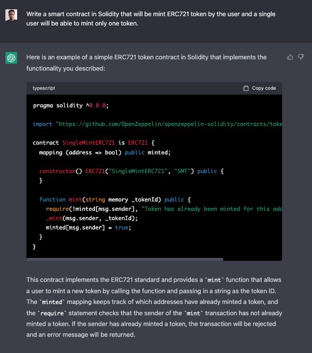
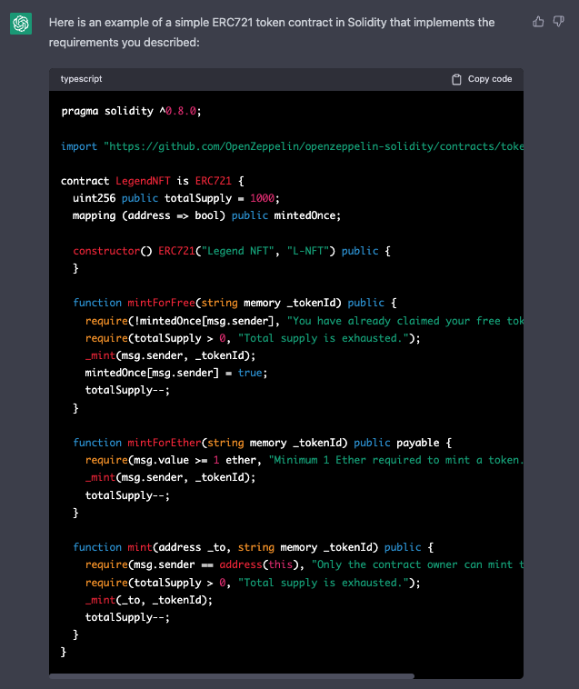
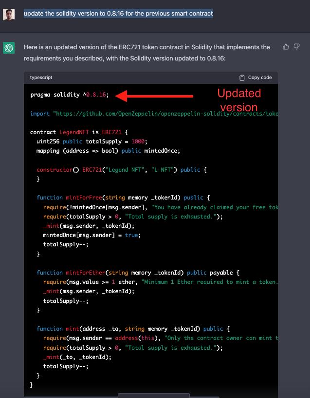
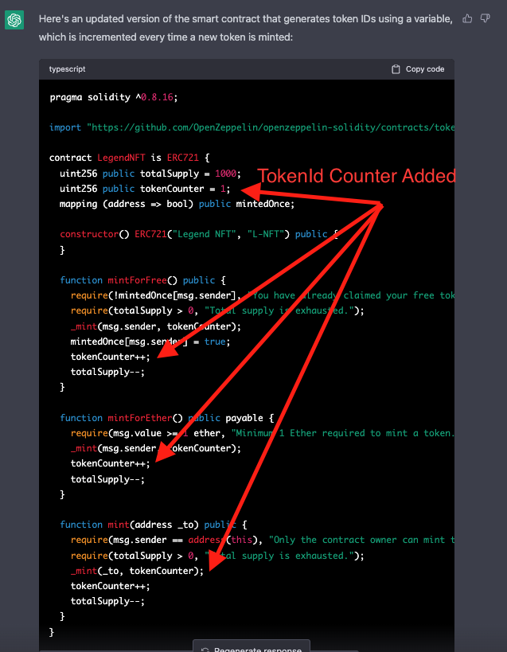
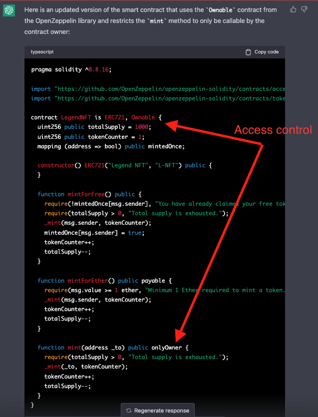
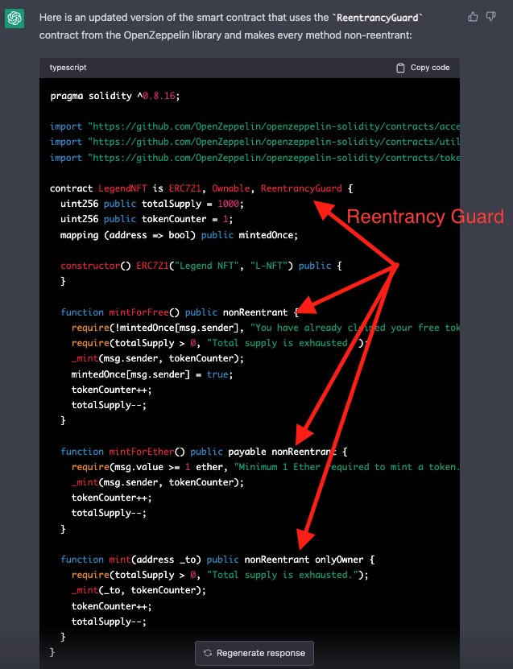

---

# Using ChatGPT for Writing Smart Contract

> Author: [Atiq Ahmed](https://www.linkedin.com/in/atiq-ahammed/)

[ChatGPT](https://chatgptonline.net/) is a conversational language model developed by OpenAI. It is based on the transformer architecture and has been trained on a large corpus of text data to generate human-like responses to a given prompt. ChatGPT can be used to generate natural language responses in various applications such as chatbots, customer service, language translation, etc.  ChatGPT can assist with writing code to some extent, but it is not designed specifically for this purpose and may not always provide accurate or reliable results.  We wanted to test its viability for generating robust and secure smart contract code.

# An ERC721 smart contract generated by ChatGPT
To get help from ChatGPT for writing smart contract code, you can provide a prompt to the model that describes the requirements for your smart contract and ask for suggestions or examples of code.  For example, you could provide the following prompt:

> Write a smart contract in Solidity that will be mint ERC721 token by the user and a single user will be able to mint only one token.

ChatGPT generated the following smart contract code from the prompt:

```Solidity
pragma solidity ^0.8.0;

import "https://github.com/OpenZeppelin/openzeppelin-solidity/contracts/token/ERC721/ERC721.sol";

contract SingleMintERC721 is ERC721 {
  mapping (address => bool) public minted;

  constructor() ERC721("SingleMintERC721", "SMT") public {
  }

  function mint(string memory _tokenId) public {
    require(!minted[msg.sender], "Token has already been minted for this address.");
    _mint(msg.sender, _tokenId);
    minted[msg.sender] = true;
  }
}
```



## The detail description provided by the ChatGPT
> This contract implements the ERC721 standard and provides a mint function that allows a user to mint a new token by calling the function and passing in a string as the token ID. The minted mapping keeps track of which addresses have already minted a token, and the require statement checks that the sender of the mint transaction has not already minted a token. If the sender has already minted a token, the transaction will be rejected and an error message will be returned.

## Positive aspects of the ChatGPT-generated code
- It generated a minimal template of ERC-721 token smart contract with correct syntax
- It used as standard library for the token standard

## A few issues with the ChatGPT-generated code
- It uses the relatively older solidity version of `0.8.0`
- The mint method contains a [reentrancy](https://www.alchemy.com/overviews/reentrancy-attack-solidity) issue. It is possible to create an attacker contract and mint more than one token using the attacker contract.
- It is taking `tokenId` as input which could be problematic if multiple users try with the same token ID.  In that case, only one of the transaction will be successful and others transaction will be failed.

# Generate a ERC721 smart contract with more complex requirement
If we try to generate a smart contract with complex requirement we get all the method and a nice template code. But we can not go to production with that code since it contains some security flaws.

## Requirement provided to ChatGPT
```dotnetcli
Create a ERC721 token smart contract with following requirements
1. contract name will be "Legend NFT"
2. contract symbol will be "L-NFT"
3. total supply will be 1000
4. Contract owner will be mint token for user for any amount
5. User will be able to mint only one token for free
6. user will be able to mint token with 1 Ether as many user wants
```

## Smart contract code generated by ChatGPT
```Solidity
pragma solidity ^0.8.0;

import "https://github.com/OpenZeppelin/openzeppelin-solidity/contracts/token/ERC721/ERC721.sol";

contract LegendNFT is ERC721 {
  uint256 public totalSupply = 1000;
  mapping (address => bool) public mintedOnce;

  constructor() ERC721("Legend NFT", "L-NFT") public {
  }

  function mintForFree(string memory _tokenId) public {
    require(!mintedOnce[msg.sender], "You have already claimed your free token.");
    require(totalSupply > 0, "Total supply is exhausted.");
    _mint(msg.sender, _tokenId);
    mintedOnce[msg.sender] = true;
    totalSupply--;
  }

  function mintForEther(string memory _tokenId) public payable {
    require(msg.value >= 1 ether, "Minimum 1 Ether required to mint a token.");
    _mint(msg.sender, _tokenId);
    totalSupply--;
  }

  function mint(address _to, string memory _tokenId) public {
    require(msg.sender == address(this), "Only the contract owner can mint tokens.");
    require(totalSupply > 0, "Total supply is exhausted.");
    _mint(_to, _tokenId);
    totalSupply--;
  }
}
```

### Generated smart contract contains the following:
- `mintForFree` function: Allows a user to mint a single token for free by calling the function and passing in a string as the token ID.
- `mintForEther` function: Allows a user to mint as many tokens as they like by sending 1 Ether or more to the contract with the token ID as the data payload.
- `mint` function: Allows the contract owner to mint a token for any user by calling the function and passing in the address of the recipient and the token ID.
- `mintedOnce` mapping keeps track of which addresses have already claimed their free token, and the require statements enforce the conditions for each function as described in your requirements.
- `totalSupply` variable keeps track of the total number of tokens available for minting, and the require statement in the mint function ensures that the contract owner is the one calling the function.

## Adding some more functional requirements to the smart contract

> Create a ERC721 token smart contract with the following requirements:
> 1. contract name will be "Legend NFT"
> 2. contract symbol will be "L-NFT"
> 3. total supply will be 1000
> 4. contract owner will be mint token for user for any amount
> 5. user will be able to mint only one token for free
> 6. user will be able to mint token with 1 ETH as many user wants



Notice that the generated ERC721 smart contract has the correct syntax and it implements the required business functionalities. However, the problematic use of the `tokenId` and the `reentrancy` issue still remains.

## Refining the ChatGPT-generated smart contract
Next, we have tried to refine the smart contract generated by ChatGPT to investigate if we are able to address the observed issues.

### Step 1: Update the solidity version
> update the solidity version to 0.8.16 for the previous smart contract

The output is:



### Step 2: Add tokenId counter and use it in mint method for tokenId
> do not get the tokenId as input. use a variable for tokenID and increment it before minting every time.

The output is:




### Step 3: Add access control for onlyOwner modifier
> use OpenZeppelin `Ownable` contract and make the mint method onlyOwner.

The output is:




### Step 4: Add Reentrancy Guard
> use OpenZeppelin ReentrancyGuard contract and make every method nonReentrant

The output is:




## The final version

```Solidity
pragma solidity ^0.8.16;

import "https://github.com/OpenZeppelin/openzeppelin-solidity/contracts/access/Ownable.sol";
import "https://github.com/OpenZeppelin/openzeppelin-solidity/contracts/utils/ReentrancyGuard.sol";
import "https://github.com/OpenZeppelin/openzeppelin-solidity/contracts/token/ERC721/ERC721.sol";

contract LegendNFT is ERC721, Ownable, ReentrancyGuard {
  uint256 public totalSupply = 1000;
  uint256 public tokenCounter = 1;
  mapping (address => bool) public mintedOnce;

  constructor() ERC721("Legend NFT", "L-NFT") public {
  }

  function mintForFree() public nonReentrant {
    require(!mintedOnce[msg.sender], "You have already claimed your free token.");
    require(totalSupply > 0, "Total supply is exhausted.");
    _mint(msg.sender, tokenCounter);
    mintedOnce[msg.sender] = true;
    tokenCounter++;
    totalSupply--;
  }

  function mintForEther() public payable nonReentrant {
    require(msg.value >= 1 ether, "Minimum 1 Ether required to mint a token.");
    _mint(msg.sender, tokenCounter);
    tokenCounter++;
    totalSupply--;
  }

  function mint(address _to) public nonReentrant onlyOwner {
    require(totalSupply > 0, "Total supply is exhausted.");
    _mint(_to, tokenCounter);
    tokenCounter++;
    totalSupply--;
  }
}
```

Our exercise revealed that ChatGPT can generate functional smart contract code for straightforward requirements, albeit with some issues. However, it is possible to overcome those limitations if an expert developer provides the right prompts that address those issues. Thus, it might be possible for an experienced smart contract developer to use ChatGPT to generate a smart contract that is fit for production.  Thorough end-to-end testing and security audits would still be necessary like any other human-generated smart contract code.